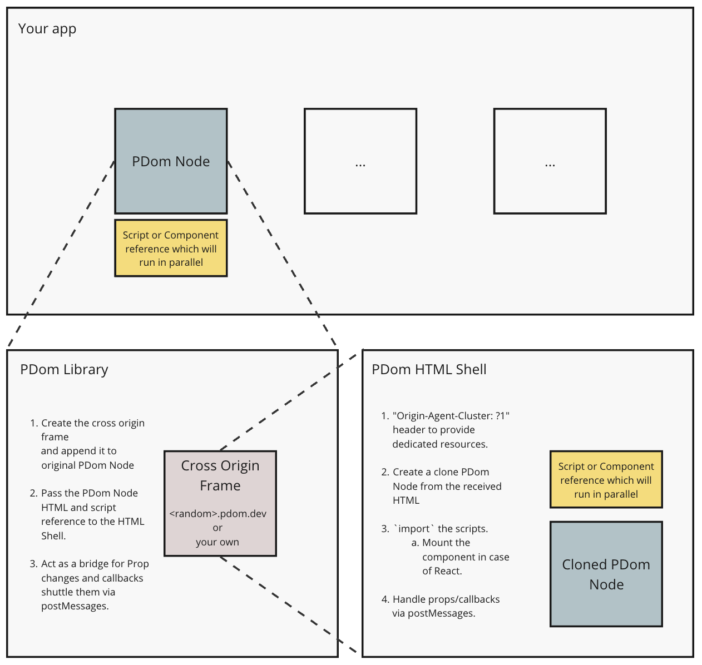

<p align="center">

</p>
<br/>

# Parallel DOM  [](https://badge.fury.io/js/parallel-dom)

Make your apps faster, parallelize away heavy DOM operations.

<br/>

## Usage

### Javascript

[Example](https://github.com/pdomdev/pdom/demo/parallel) | [Demo](https://demo.pdom.dev/parallel/)

```js
import PDom from 'parallel-dom';

const pdom = new PDom(
    // The root, the subtree will be 
    // made parallel.
    '#root', 

    // Javascript entry point of the script 
    // to run parallely inside the parallel subtree.
    () => import('path/to/script/which/runs/in/parallel') 
);
pdom.render();
```

### React


[Example](https://github.com/pdomdev/pdom/demo/react) | [Demo](https://demo.pdom.dev/react/)

```jsx
// parallel-component.tsx
const ParallelComponent = ({ prop1, onCallback }) => {
    // heavy operations.
    // ...
    return <button onClick={onCallback}>{prop1}</button>
}
```

```jsx
import PDom from 'parallel-dom/react';

const ParallelComponent = PDom(() => import('./parallel-component'));

export const App = () => {
    const [p1, setP1] = useState('');
    return <>
        ...
        <ParallelComponent prop1={p1} onCallback={cb} />
    </>
}
```

#### React limitations

1. Not supported: unserializable props (JSX in props etc.)
2. Callbacks in Props are supported, but they are all async.


## Under the hood



1. Creates a dummy shell iframe on a subdomain.
2. Passes the scriptUrl and creates a clone of the passed DOM element to the above frame.
3. The iframe loads and runs the script.
4. Since, iframe is cross origin, the browser creates a dedicated process for it.
5. We use `origin-agent-cluster` header to enable multiple `PDom` to have their own dedicated subframe process.

For more details:

- [Performance isolation with the Origin-Agent-Cluster header](https://web.dev/articles/origin-agent-cluster)


## Supported Browsers

- Chrome
- Edge

Degrades to single threaded, on unsupported browsers.

## Self hosted

You can host PDom on your own if you want to avoid using the `pdom.dev` domain for some reason.

### Vercel
Quick deploy on Vercel.

[](https://vercel.com/new/clone?repository-url=https%3A%2F%2Fgithub.com%2Fpdomdev%2Fpdom&project-name=pdom&redirect-url=pdom.dev&build-command=npm%20run%20build&output-directory=dist)

### Your own infrastructure

1. `git clone https://github.com/pdomdev/pdom`
2. `cd pdom`
3. `npm i`
4. `npm run build`
5. Serve the `dist` folder with your own static server (like nginx). Or could use [http-server](https://www.npmjs.com/package/http-server).
6. You could also do `npm start` to run a local developement server.

### Domain and header configuration

- Configure the web server to add the following response header (Already done in the above template for vercel):

```
Origin-Agent-Cluster: ?1
```

- Configure a wildcard subdomain, with your DNS. [Here](docs/wildcard.md) is some documentation on how to do this with common Domain providers.


## FAQ

- What are you talking about ? iFrames suck!

iFrames were once insecure and often used for nefarious purposes. Browser makers have introduced many new security requirements as either defaults or even removed the older insecure ways entirely. The technology has advanced significantly. Some of the security features PDom uses to secure the iframes:

```
Sandboxing:

Sanboxed Iframes create a secure context 
with no access to the parent's context.
```
```    
In browser script injection: 

Your javascript is never hosted on PDom server. 
Its injected at runtime by your parent application to the frame.
```
<br/>

- I don't trust a third party domain. Can I host this myself ?

Absolutely! The whole thing is open source, and we have included documentation on how to host this yourself. We have also built a Vercel template for you to quickly deploy the service if you use Vercel.

FWIW, you could use any static hosting provider, like github pages, netlify etc. As PDom does not really need a backend server, it's purely client.
